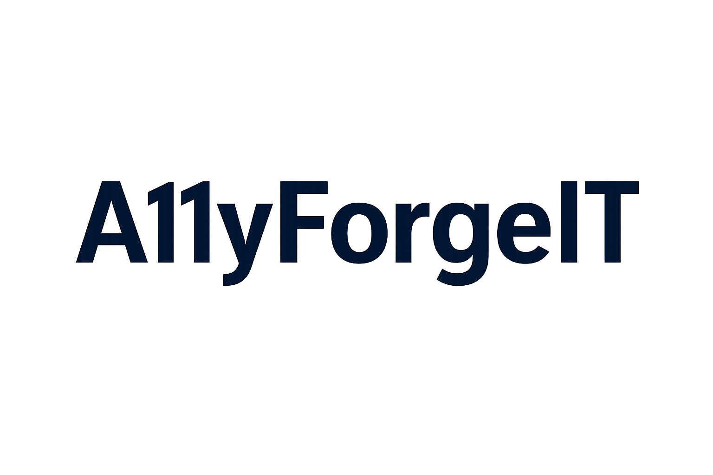

# A11yForgeIT

<p align="center">
  
</p>

## Overview
A11yForgeIT is a lightweight, open-source template designed to help developers and organizations quickly launch accessible websites.  
This project demonstrates **best practices in accessibility (a11y)** and provides prebuilt components for rapid development.  

---

## ✨ Features
- Semantic **HTML5 structure**
- **Responsive design** for desktop and mobile
- **Accessibility controls** (font size toggle, high-contrast mode)
- Styled **dark footer** with links to legal and documentation pages
- Easy-to-extend structure (just HTML + CSS)

---

## ♿ Accessibility Features
- Keyboard-friendly navigation (no traps)
- Adjustable text size controls
- High-contrast toggle for improved visibility
- WCAG 2.1 AA compliant color palette
- Screen-reader-friendly landmarks and headings

---

## 📂 Project Structure
```
a11yforgeit_site/
│── index.html            # Homepage
│── about.html            # About page
│── contact.html          # Contact page
│── faq.html              # Frequently Asked Questions
│── privacy.html          # Privacy Policy
│── terms.html            # Terms of Service
│── accessibility.html    # Accessibility Statement & Commitment
│── docs.html             # Documentation / Knowledge Base
│── styles.css            # Global styles
│── logo.png              # Project logo (placeholder)
```

---

## 🚀 Getting Started

1. **Clone the repository:**
   ```bash
   git clone https://github.com/yourusername/a11yforgeit.git
   cd a11yforgeit
   ```

2. **Open in browser:**
   Just open `index.html` in your preferred browser.

3. **Customization:**
   - Update `styles.css` to match your branding.  
   - Replace `logo.png` with your own project or company logo.  
   - Edit `privacy.html`, `terms.html`, and `accessibility.html` with your own policies.  

---

## 🛡 License
This project is licensed under the [MIT License](LICENSE).

---

## 🤝 Contributing
We welcome contributions! See [CONTRIBUTING.md](CONTRIBUTING.md) for guidelines.  

---

## 📫 Contact
For questions, suggestions, or accessibility feedback, please open an [issue](../../issues) or contact us directly.  
